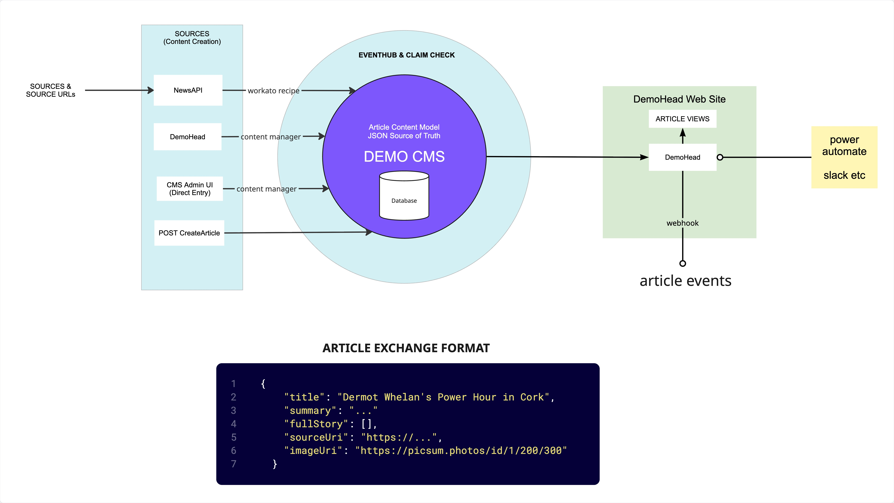

# Headless CMS Overview

- Decouple the content repository from presentation.
- Allows creators to manage content in one place (the repository)
- Allows developers to deliver this content to any device or platform via APIs
- Supports omnichannel publishing and enables rapid development cycless.

## Demo and walkthrough

[Demo architecture](https://miro.com/app/board/uXjVGFZX7vw=/?moveToWidget=3458764658752020348&cot=14)

### Steps

**Demo CMS**

- [Strapi Cloud App](https://deserving-frogs-345174c2a8.strapiapp.com/admin) and article data model 
- Demo- Strapi Cloud GraphQL - [Apollo Explorer](https://deserving-frogs-345174c2a8.strapiapp.com/graphql)
- Updating and adding articles in Strapi [content manager]()

**'Demo Head' Combined View and Manage App**

- Viewing the feed in the [demohead app](http://localhost:3000/)
- Viewing full article in demohead
- Editing an article in demohead with multimodal previews
- Adaptive cards - MS Power Automate

**Other topics**

- Newsletters vs feeds, Emails vs live views
- Rich text options
    - Add new article based on Pop news - HTML vs MD vs Blocks
- [NewsAPI](https://www.newsapi.ai/documentation/sandbox?tab=searchArticles&searchMode=concept&locations=4-en-Cork_(city)-Cork%20(city),%20Ireland&lang=eng&lang=cat&lang=ara&lang=gle&lang=jpn) query and article format
- Workato NewsApi [webhook recipe](https://app.eu.workato.com/recipes/1825735-articles-import#recipe)

